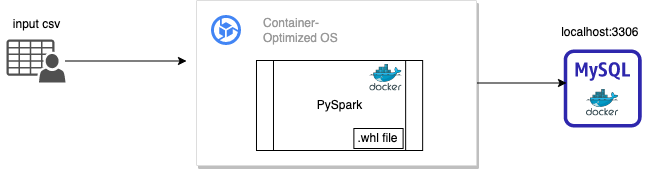
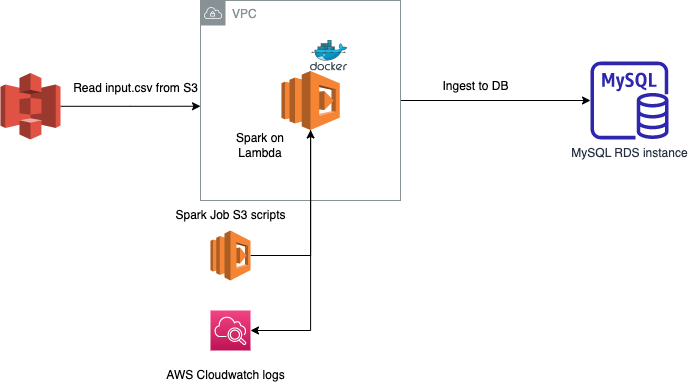

# data-ingestion-py
Data Ingestion using Python and PySpark

Prerequisites:
====
* `pyspark` is installed. 
* `venv` is activated
* `MySQL` docker is running
* `mysql-connector` jar is available and added to spark jars (only when running without docker)

* In order to run MySQL docker, pull the image and run it locally as below
* If running on M1 Mac, add flag `--platform linux/amd64` to docker commands

System Overview
---------------
#### Local


#### AWS Serverless


### Commands:
```
docker pull mysql
docker run --name mysql -p 3306:3306 -e MYSQL_ROOT_PASSWORD=root -d mysql
docker exec -it mysql /bin/sh
```

* Once logged into the docker container, enter MySQL prompt using below command
```
mysql -u root -p
```
and enter password as `root`

* Run the commands in `person.sql` script provided at the root of the repo to create a database and table in MySQL.

Setup
=====
**1. Clone the repo**

    git clone https://github.com/mbelsare/data-ingestion-py.git

**2. Create Virtual Environment**

If you prefer PyCharm IDE - please check this guide - https://www.jetbrains.com/help/pycharm/creating-virtual-environment.html to create `venv` environment.

If you prefer to work from shell / vim / working on remote host:

    python3.10 -m virtualenv --python=/usr/bin/python3.10 ./env

**3. Activate Environment**

 For `venv` on local machine:

    source venv/bin/activate

**4. Install Dependencies**

    pip install -r requirements.txt

* After activating `venv`, make sure `spark` is installed by running `pyspark` on your terminal. It should bring up a spark-shell

Module Overview
====
The ingestion module has 3 functional scripts:
1. The main entrypoint code that exist in `dataingestion.py`
2. Spark Session initializer in `sparkinitializer.py`
3. DataFrame's operations in `dataframe_operations.py`

Execution challenges:
====
* If the docker container runs into `java.net.ConnectException: Connection refused (Connection refused)`, then you might need to provide the hostname to IP of the MySQL docker container or change default value in `dataingestion.py` argument parser.
* Second option is to build a `wheel` package of the project as provided in `Deploment Options` -> **2.1** and run the package with any runtime options.

Deployment Options
====

## 1. Deploying using Docker
* The `Dockerfile` has been added to the project to build from source
```
docker build --tag ingestion:0.1 .
docker run ingestion:0.1
```
* The current docker container uses default values to connect to mysql server running locally. 
* If need to override default values, run with `-e <options...>`.
```
docker run -e "<key=value>" ingestion:0.1
```

## 2.1 Build a wheel distribution of the project

    cd data-ingestion-py
    python setup.py bdist_wheel
    pip install --force-reinstall dist/data_ingestion_py-0.0.1-py3-none-any.whl

* The `setup.py` command will create a wheel file with a name like `my_package-0.0.1-py3-none-any.whl` in the `dist/` directory.
* The `pip install` command will install your package. The name of the package is provided in `setup.py` **entry_points** block

**PS**: For the purpose of building the wheel and creating an entrypoint, all functions are merged in `dataingestion.py` but the ultimate goal is to modularize each into its own classes

### 2.2 Run the package

* Once your package is installed, you can run your script from the command line using the entry point you specified in your setup.py file. In this example, you would run:
```
ingest_data --input_path <path/to/input/csv/file>
```
* If no additional arguments are provided to above entrypoint command eg. 
```
--mysql_host | --mysql_port | --mysql_db | --mysql_table | --db_user | --db_password
```
then the code will pick up default values set to `localhost`.
